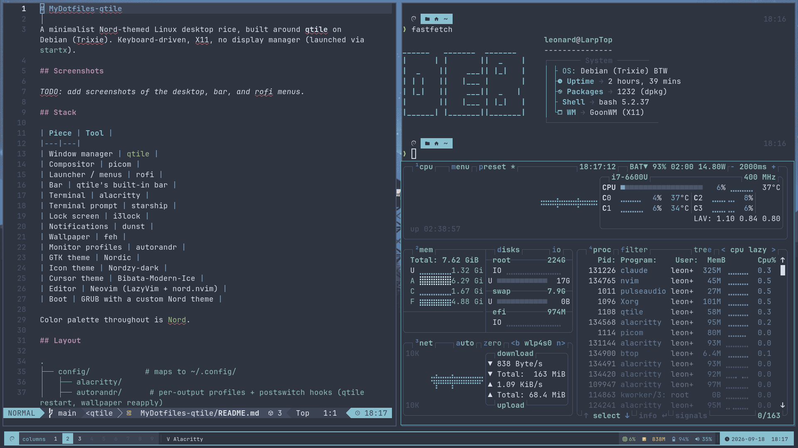
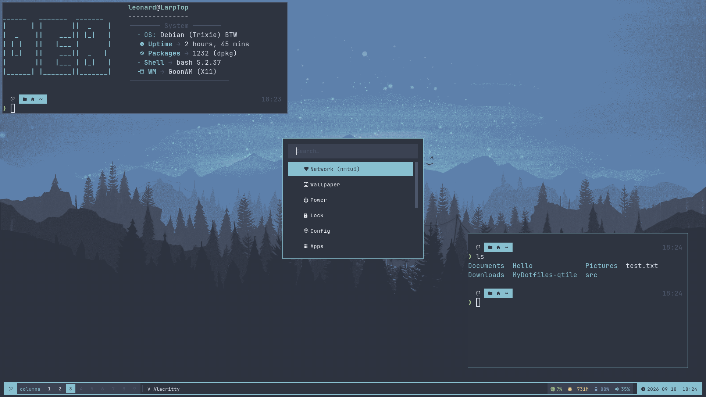

# MyDotfiles-qtile

A minimalist Nord-themed Linux desktop rice, built around **qtile** on Debian (Trixie). Keyboard-driven, X11, no display manager (launched via `startx`).

## Screenshots  

### Screenshot 1 


### Screenshot 2 


## Stack

| Piece | Tool |
|---|---|
| Window manager | [qtile](https://qtile.org/) |
| Compositor | picom |
| Launcher / menus | rofi |
| Bar | qtile's built-in bar |
| Terminal | alacritty |
| Terminal prompt | starship |
| Lock screen | i3lock |
| Notifications | dunst |
| Wallpaper | feh |
| Monitor profiles | autorandr |
| GTK theme | Nordic |
| Icon theme | Nordzy-dark |
| Cursor theme | Bibata-Modern-Ice |
| Editor | Neovim (LazyVim + nord.nvim) |
| Boot | GRUB with a custom Nord theme |

Color palette throughout is [Nord](https://www.nordtheme.com/).

## Layout

```
.
├── config/            # maps to ~/.config/
│   ├── alacritty/
│   ├── autorandr/      # per-output profiles + postswitch hooks (qtile restart, wallpaper reapply)
│   ├── btop/
│   ├── dunst/
│   ├── eza/             # Nord theme.yml for eza
│   ├── fastfetch/
│   ├── flameshot/
│   ├── gtk-3.0/
│   ├── gtk-4.0/
│   ├── i3lock/
│   ├── nvim/             # only the Nord colorscheme override, not the full LazyVim scaffold
│   ├── picom/
│   ├── qtile/             # bar, keybinds, layouts + qtile/scripts/
│   ├── rofi/               # theme + scripts/, including the modular action menu (see rofi/README.md)
│   └── starship.toml
├── home/                # maps to ~/
│   ├── .bashrc
│   ├── .xinitrc
│   └── Pictures/
│       └── Wallpapers/    # the Nord wallpaper set rofi/scripts/wallpaper.sh picks from
└── boot/
    └── grub-themes/nord-minimalist/   # maps to /boot/grub/themes/nord-minimalist
```

## Not included, on purpose

- **`~/.config/alacritty/themes/`** — this is a clone of the community [`alacritty/alacritty-theme`](https://github.com/alacritty/alacritty-theme) repo, not personal config. `alacritty.toml` imports `~/.config/alacritty/themes/themes/nord.toml` from it, so it needs to exist at that path. Get it with:
  ```sh
  git clone https://github.com/alacritty/alacritty-theme ~/.config/alacritty/themes
  ```
- **GTK theme / icon theme / cursor theme packages** (Nordic, Nordzy-dark, Bibata-Modern-Ice) — these are installed system themes referenced by name in `gtk-3.0/gtk-4.0/settings.ini` and `.xinitrc`, not files that belong in a dotfiles repo. Install them separately (package manager / your distro's theme repos) before applying these configs.

## Installing

### Debian Trixie (automated)

```sh
git clone git@github.com:LeonardWurmsdobler/MyDotfiles-qtile.git ~/MyDotfiles-qtile
cd ~/MyDotfiles-qtile
./install.sh --dry-run   # see everything it would do first
./install.sh
```

It installs the apt package stack, builds/fetches the few pieces not in Debian's repos (starship, i3lock-color, Nordic/Nordzy-dark/Bibata-Modern-Ice, a JetBrainsMono Nerd Font, LazyVim), symlinks this repo's configs into place (backing up anything already there), and — after an explicit y/N prompt — installs the GRUB theme. Safe to re-run.

### Other distros (manual)

`install.sh` is apt-only. Elsewhere, it's just two steps:

1. **Install the dependencies** — see the [Stack](#stack) table above for what's needed, plus `network-manager`, `alsa-utils`, `brightnessctl`, `imagemagick`, and a Nerd Font, through your distro's package manager (`pacman`, `dnf`, `zypper`, ...). A few pieces won't be packaged anywhere and need to come from source/upstream regardless of distro: [i3lock-color](https://github.com/Raymo111/i3lock-color), [Nordic](https://github.com/EliverLara/Nordic), [Nordzy-icon](https://github.com/alvatip/Nordzy-icon), and [Bibata-Modern-Ice](https://github.com/ful1e5/Bibata_Cursor).
2. **Symlink what you want:**
   ```sh
   ln -s ~/MyDotfiles-qtile/config/qtile ~/.config/qtile
   ln -s ~/MyDotfiles-qtile/config/rofi ~/.config/rofi
   # ...repeat for whichever pieces of config/ you want
   ```
   Plus `home/.bashrc` / `home/.xinitrc`, `home/Pictures/Wallpapers/` (symlink or copy to `~/Pictures/Wallpapers`), and the GRUB theme (`boot/grub-themes/nord-minimalist/`, which needs `sudo cp -r` into `/boot/grub/themes/` and `GRUB_THEME` set in `/etc/default/grub`, then a `grub-mkconfig`/`update-grub` equivalent for your distro).

## qtile keybinds

`mod` = Super (mod4).

| Key | Action |
|---|---|
| `mod + j/l/k/i` | Move focus left/right/down/up |
| `mod + shift + h/l/j/k` | Move window left/right/down/up |
| `mod + control + h/l/j/k` | Grow window left/right/down/up |
| `mod + n` | Reset all window sizes |
| `mod + Tab` | Next layout |
| `mod + w` | Kill focused window |
| `mod + f` | Toggle fullscreen |
| `mod + t` | Toggle floating |
| `mod + control + r` | Reload qtile config |
| `mod + control + q` | Shutdown qtile |
| `mod + r` | Spawn command prompt |
| `mod + Return` | Launch terminal |
| `mod + shift + Return` | Launch Firefox |
| `mod + [1-9]` | Switch to group |
| `mod + shift + [1-9]` | Move focused window to group |
| `mod + space` | rofi drun |
| `mod + d` | rofi action menu (see below) |
| `mod + Escape` | Power menu |
| `mod + shift + l` | Lock screen |
| `mod + shift + space` | Wallpaper picker |
| `mod + shift + c` | nmtui (network) in a terminal |
| `mod + shift + o` | Disable external monitor |
| `Print` | Flameshot region screenshot |
| Volume / brightness media keys | amixer / brightnessctl |

## The rofi action menu (`mod + d`)

A modular menu — each entry is a standalone script in `config/rofi/scripts/menu/` with a `# LABEL:` comment line; the dispatcher (`config/rofi/menu.sh`) scans that folder and builds the list from it, so adding a feature is just dropping in a new file. Full details, including how to add your own entry, are in [`config/rofi/README.md`](config/rofi/README.md).

Current entries: Network (nmtui), Wallpaper, Power, Lock, Config (opens `qtile/config.py` in nvim), Apps (rofi drun).

## License

[MIT](LICENSE)
